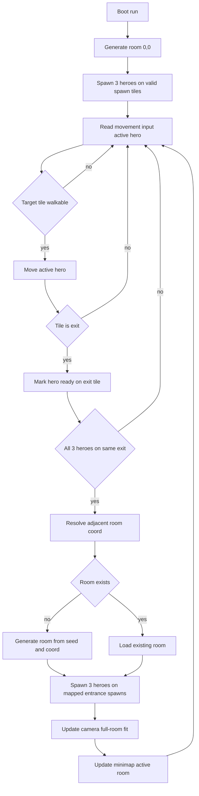

# Phase 1 MVP Implementation Plan - Simple Dungeon + Autogeneration

## Goal
Implement the first playable technical slice of SimpleHero focused on:
- Procedural dungeon room generation
- 3-hero party spawn
- Infinite traversal by generating new rooms on demand
- Party movement only on valid walkable tiles
- Camera always showing the full current room
- UI minimap showing room graph and current room position
- Strict tile taxonomy for this phase: Spawn, Exit, Floor. Everything else is black

## Confirmed Scope Inputs
- Based on [`docs/gdd.md`](docs/gdd.md), dungeon generation is enabled for MVP.
- User confirmation: render only current room, camera framed to full room, UI shows map with player location.
- User update: there are always 3 heroes, all 3 must use the same exit to transition.
- User update: only 3 playable tile types now: Spawn, Exit, Floor.

## Acceptance Criteria
1. Game starts in one generated room with valid spawn tiles for exactly 3 heroes.
2. Current room is fully visible in camera at all times.
3. Party can move infinitely through dungeon expansion.
4. Movement is allowed only to walkable tiles: Spawn, Exit, Floor.
5. Input is click based and computes path with A* on the current room grid.
6. Player can switch active hero at any moment.
7. Before confirming movement, a visible path preview shows the exact planned route.
8. Invalid click targets or unreachable targets do not change hero position.
9. Room transition only happens when all 3 heroes have reached the same exit tile.
10. Main view renders only current room.
11. UI minimap shows discovered rooms and highlights current room.
12. Any tile not in Spawn, Exit, Floor is rendered as black.

## Technical Plan

### 1. Domain Model
Create data contracts for dungeon, room, tiles, and party state.
- `RoomId` from integer grid coordinate `x,y`
- `TileType` enum:
  - `SPAWN`
  - `EXIT`
  - `FLOOR`
  - `VOID_BLACK`
- Walkability by tile type:
  - `SPAWN=true`
  - `EXIT=true`
  - `FLOOR=true`
  - `VOID_BLACK=false`
- `RoomData`:
  - `id`
  - `coord`
  - `width`, `height`
  - `tiles` matrix of `TileType`
  - `exits` by cardinal direction with tile coordinates
  - `spawnTiles` list of exactly 3 tile coordinates
- `DungeonState`:
  - dictionary of generated rooms by `RoomId`
  - current room id
  - world seed
  - discovered room ids for minimap
- `PartyState`:
  - fixed array of 3 heroes
  - each hero has current room id and tile position
  - active hero index for movement input routing
  - exit readiness set by hero id for current room exit tile

### 2. Procedural Generation Strategy
Use seeded deterministic generation so same room coordinate always resolves the same layout.
- Base seed per run generated once at boot.
- Room seed derived from hash of run seed + room coord.
- For each room:
  - Build fixed-size tile grid.
  - Default all tiles to `VOID_BLACK`.
  - Carve playable area with only `FLOOR`.
  - Place exits as `EXIT` on edges by deterministic rules.
  - Place exactly 3 `SPAWN` tiles by deterministic rules.
  - Ensure all `SPAWN` tiles connect to at least one `EXIT` through walkable tiles.

### 3. Infinite Expansion Rules
When party uses an exit:
- Each hero moves independently but transition is gated.
- Mark heroes as ready when standing on chosen `EXIT` tile.
- Transition executes only when all 3 heroes are on the same `EXIT` tile.
- Compute adjacent room coord from selected exit direction.
- If room exists: load it.
- If room does not exist: generate and register it.
- Spawn all 3 heroes at mapped entrance-side spawn tiles in target room.
- Mark target room as discovered for minimap.

### 4. Spawn Rules
- Initial room coord: `0,0`.
- Initial spawn tiles: exactly 3 deterministic spawn tiles grouped near room center.
- Spawn tile constraints:
  - all unique
  - all walkable `SPAWN`
  - each has path to at least one `EXIT`
- Transition spawn tiles: mapped entrance-side spawn cluster in target room.
- Fallback safety: if any planned spawn invalid, BFS nearest valid `FLOOR` reassignment preserving uniqueness.

### 5. Movement and Pathfinding System
Grid movement with no per-turn cap in this phase.
- Input is mouse click on target tile.
- Pathfinding uses A* over current room walkable grid.
- Path search allows only `SPAWN`, `EXIT`, `FLOOR` tiles.
- While hovering tiles, render and refresh path preview overlay in real time from hero tile to hovered target tile.
- On confirmation click, lock the currently previewed path and execute step by step.
- If target is unreachable, show no preview and do not move.
- If click target is `VOID_BLACK`, ignore action.
- On reaching `EXIT` tile, mark that hero as exit-ready for that exact exit.
- If a hero leaves the exit tile before transition, clear readiness for that hero.
- Trigger room transition only when all 3 heroes are ready on the same exit tile.

### 6. Camera Rules
- Camera bounds set to current room pixel rectangle.
- Zoom chosen so whole room fits viewport.
- Recompute fit on room change and window resize.
- No scrolling outside room.

### 7. Rendering Rules
- Draw only current room tilemap and current room entities.
- Destroy or pool previous room render objects on transition.
- Non-current rooms are not rendered in world view.
- Tile visual policy for this phase:
  - `FLOOR` rendered as grey square tile with visible border
  - `EXIT` rendered in blue
  - `SPAWN` rendered in red
  - `VOID_BLACK` rendered black
- Hero visual policy for this phase:
  - each hero rendered as a circle
  - each hero includes a small facing triangle to indicate front direction
  - each hero includes class initial letter to differentiate heroes
  - recommended MVP letters: `W` Warrior, `R` Ranger, `M` Mage

### 8. Minimap UI Rules
- Minimap based on discovered room coordinates.
- Each discovered room shown as node or cell.
- Current room highlighted distinctly.
- Optional visible connection lines for N/E/S/W adjacency.
- Minimap updates after each successful room transition.

### 9. Phaser + TypeScript Implementation Breakdown
- `src/data/`
  - `dungeonTypes.ts`
  - `tileTypes.ts`
- `src/utils/`
  - `seed.ts`
  - `coord.ts`
  - `grid.ts`
- `src/systems/`
  - `dungeonGenerationSystem.ts`
  - `roomTransitionSystem.ts`
  - `movementSystem.ts`
  - `partySystem.ts`
  - `cameraSystem.ts`
- `src/entities/`
  - `hero.ts`
  - `party.ts`
- `src/ui/`
  - `minimap.ts`
- `src/core/`
  - `gameScene.ts`
  - `boot.ts`

### 10. Validation Checklist
- Every generated room has at least one `EXIT` and exactly 3 `SPAWN` tiles.
- Initial 3-hero spawn always lands on 3 unique walkable spawn tiles.
- Heroes never enter non-walkable tiles.
- Exit transition requires all 3 heroes on same exit tile.
- Exit transition always lands all heroes in valid spawn tiles in target room.
- Returning to previously visited room preserves deterministic layout.
- Camera always frames full room.
- Minimap room highlight matches active room.
- Room tiles use only Spawn, Exit, Floor as playable taxonomy and everything else is black.

## Out of Scope for Phase 1
- Combat
- Enemies and AI
- Items and loot
- Skills and spells
- Progression and economy systems
- Save and load persistence beyond optional debug seed

## Tile Taxonomy Spec
- `SPAWN`: walkable, used for initial and transition party placement.
- `EXIT`: walkable, used to request room transition.
- `FLOOR`: walkable, standard movement surface.
- `VOID_BLACK`: non-walkable, rendered black.

Only `SPAWN`, `EXIT`, and `FLOOR` are playable tiles in this phase.

## Mermaid Flow

